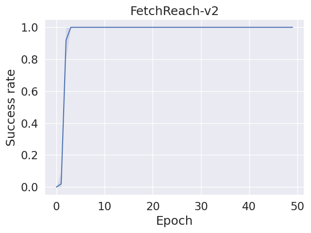
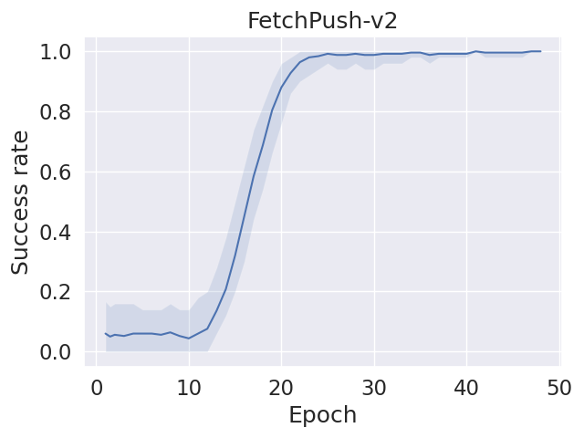
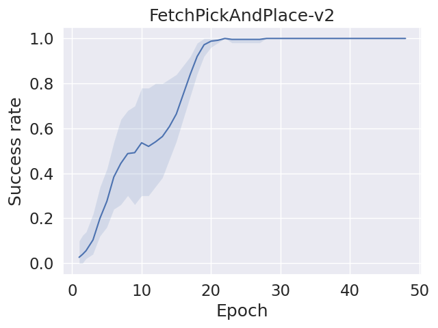
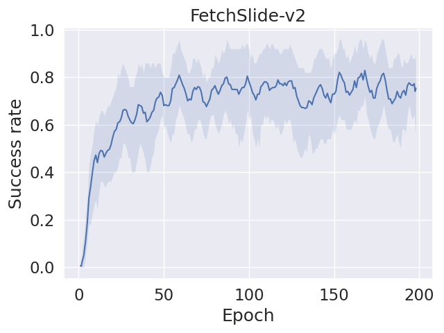
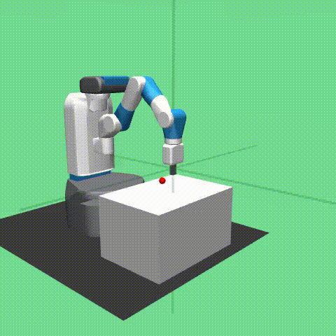

# TD3+HER  for Fetch Robot Tasks

# TD3 (Twin Delayed DDPG): 

TD3 is an algorithm used in reinforcement learning. It's an extension of the Deep Deterministic Policy Gradients (DDPG) algorithm, designed to improve stability and sample efficiency in training deep reinforcement learning agents.

# HER (Hindsight Experience Replay): 
HER is a technique used in reinforcement learning to address the sparse reward problem. In many cases, an agent may receive a sparse reward signal, making it challenging to learn a good policy. HER addresses this by allowing the agent to learn from failures by considering alternative goals. It replays and learns from past experiences, even if the achieved outcome was not the original goal.

# TD3+HER

This combination aims to enhance the learning efficiency and robustness of the agents, especially in scenarios where the reward signals are sparse or challenging to define.

# Tasks

- FetchReach-v2: Fetch has to move its end-effector to the desired goal position.

- FetchPush-v2: Fetch has to move a box by pushing it until it reaches a desired goal position.

- FetchSlide-v2: Fetch has to hit a puck across a long table such that it slides and comes to rest on the desired goal.

- FetchPickAndPlace-v2: Fetch has to pick up a box from a table using its gripper and move it to a desired goal above the table.

# Results
|_|_|
|:---:|:---:|
| |
| |

# Demo

Reach| Push|
-----------------------|-----------------------|
| |

Pick And Place | Slide|
-----------------------|-----------------------|
|

# Reference
- TD3: https://arxiv.org/abs/1802.09477
  
- Open AI: https://doi.org/10.48550/arXiv.1707.01495
  
- Environment: https://robotics.farama.org/envs/fetch/
